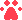
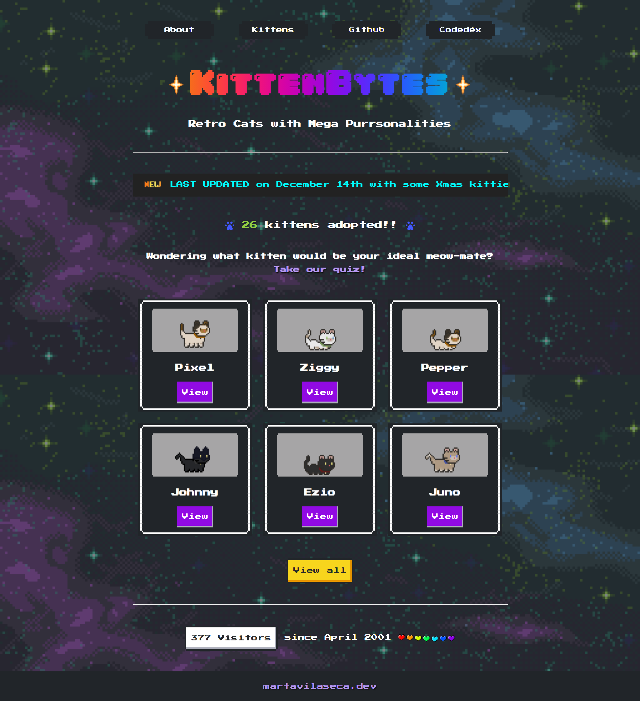
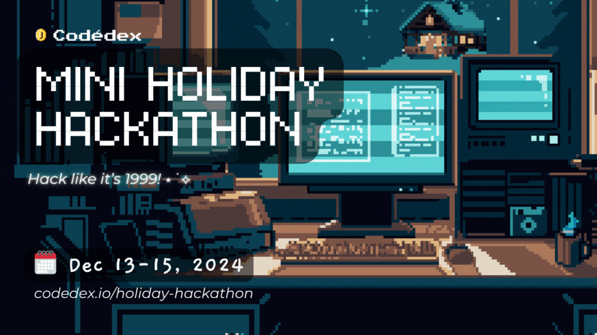
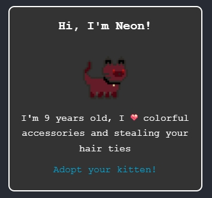

#  KittenBytes - Retro Cats with mega purrsonalities!

> [!IMPORTANT]  
> This project is purposefully retro in several ways, as part of the challenge it was created for - hence the use of some old techniques, elements and visuals throughout :)

- [The Challenge](#the-challenge)
- [The Idea](#the-idea)
- [Features and Details](#features-and-details)
- [Tools used](#tools-used)
- [Development notes](#development-notes)
- [Credits](#credits)

> Remember virtual pet adoption sites? KittenBytes is a playful, retro-style virtual pet adoption site where you can find your purr-fect digital companion 💗 Answer a fun quiz to discover which kitten best matches your personality, then adopt your new pixelated friend! With charming designs and lovable kittens, KittenBytes brings back the joy of virtual pet adoption with a modern twist 😸

## The Challenge

This project is part of the [2024 Codedéx Holiday Hackaton](https://www.codedex.io/holiday-hackathon) challenge. I decided to join the challenge on its **Track 2: Now It's Personal** variant, which asked us **to create our own personal portfolio, fansite, or original product with a retro vibe**.

## The Idea

My only idea going into the Hackathon was that I wanted my design to be **pixel-art based**, since I'm a big fan of the aesthetic and I've wanted to do something in that vibe for _ages_.

I focused on my interests and hobbies and initially considered making a little fansite about video games. It would've fitted the theme nicely, it would have been a fun callback to what I was actually doing back in the late 90s and early 00s... but I quickly ruled it out, because it would have been too much work to do in only 48 hours and whatever I ended up doing, I wanted to get it right.

Then I started reminiscing about The Old Internet Days™ in general, and it didn’t take me long to remember **virtual pet adoption sites** and those long afternoons answering **fun little quizzes**... and _then_ I knew I was onto something.

Being the cat lover I am, of course I decided to make a kitten adoption site. Besides, [cats are still the rulers of the interwebs after all](https://www.wired.com/2015/08/how-cats-took-over-the-internet/): it's a universal law, you can never go wrong with cats.

## Tools used

   

### Development Notes

**I decided to keep things simple in purpose,** to honor the hackaton terms as much as possible and also to challenge myself a little - so I've been sticking to the basics as much as I could (even if the site is not historically accurate, since I _have_ used some modern techniques after all, out of necessity).

You'll see some inline styles (_gasp_), not super semantic markup, a table to render the kittens list (because I needed to include a tiny nod to those nightmare-inducing table-based layouts somewhere) and even a `<marquee>` element - which I didn't know still works in modern browsers!

Obviously, this means **the site is not responsive at all and is best viewed on desktop** - although I've been slightly generous with the layout dimensions: had I wanted historical accuracy I should've stayed within the 800x600 resolution, and the final interface is slightly bigger than that.

After the last months focusing on TypeScript, React or Next.js playing only with the essentials has been so, so fun 💗

## Features and details

- Intentional use of retro elements such as tables to display content (for the adoptable kittens) or the `<marquee>` element to display the continuously scrolling 'last update' notice
- Use of retro style hit counter and adoptions counter to keep track of the adopted cats
- There's two JSON files with data: [one for the adoptable kittens](./data/kittens.json) and [one for the quiz questions](./data/questions.json)
- Homepage displays six random kittens picked from the JSON data file. Clicking on the view button leads to their individual profiles
- Every kitten profile has a **short kitten bio** and an **adopt** button
  - Clicking on the adopt button will increase the adoptions counter
  - ... and display a thank you message, along with a **generated embed code** that you can copy and paste on your website in order to display your new pixel companion:

- If you try to adopt a kitten that you've already adopted, a good old school **alert window** will warn you about that
  - _(kittens that you've already adopted are saved in your local storage)_
- You can also view a full list of all the kittens in the **Kittens** page, and access their individual profiles from there as well

### The quiz

The most fun part of this little app: you can **take a personality quiz** to get matched to one of the kittens!

- **Dynamic Question Loading:**
  When the page loads, the quiz fetches a list of questions from the JSON file. These questions are shuffled to ensure variety and a subset of 6 is selected randomly for the quiz.
- **Answering Questions:**
  Each question presents two answer choices. Users select their preferred options, which correspond to specific trait values.
- **Ensuring All Questions Are Answered:**
  To prevent incomplete submissions, the "Find My Kitty!" button is disabled until all questions are answered. The script monitors the quiz dynamically and updates the button state accordingly.
- **Processing the Results**
  - _When the user submits the quiz:_
    - The script collects the selected answers and calculates a score for each kitten in the [database](./data/kittens.json) by comparing the user's selected traits with the traits of each kitten.
    - Each matching trait increases the score for that kitten.
  - _Finding the Best Match:_
    - The kitten with the highest score is identified as the user's best match.
    - If there's no high-scoring match, the user is encouraged to try again.
- **Displaying the Results:**
  The user is redirected to a profile page of their matched kitten, complete with an adorable description picture of their new digital companion and (as explained above) the option to adopt the kitten and get the embed code to display it on their website.

## Credits

I would like to give a very **sincere THANK YOU to [Codedéx](https://www.codedex.io/)** for organising this hackaton, because this little project is the most fun I´ve had coding in ages! 💗 And last but not least, to all the pixel artists whose work has helped me build all of this in a little less than 24 hours 😻

Without further ado, full credits list for everything I used for the project:

##### Sprites and pixel art

<ul>
            <li><a target="_blank" href="https://virusystem.itch.io/background-space">This space background</a> by Virusystem @ itch.io</li>
            <li><a target="_blank" href="https://toffeebunny.itch.io/cat-pixel-mega-pack">TofeeBunny's Cat Pixel Mega Pack</a> @ itch.io for the kitten sprites 💗</li>
            <li><a target="_blank" href="https://nyknck.itch.io/staranimation">This animated star by nycknck</a> @ itch.io</li>
            <li><a target="_blank" href="https://www.deviantart.com/zapilai/art/Rainbow-heart-divider-pixel-gif-462626305">This rainbow heart divider</a> by zapilai @ Deviantart</li>
            <li><a target="_blank" href="https://www.deviantart.com/korajora/art/Little-Pixel-Heart-600475302">This little pixel heart</a> by Korajora @ Deviantart</li>
            <li><a target="_blank" href="https://www.deviantart.com/nerdy-pixel-girl/art/Rainbow-Cat-Paw-Print-Bullet-F2U-658019729">The Rainbow Cat Paw Print
            </a> by Nerdy-pixel-girl @ Deviantart</li>
            <li><a target="_blank" href="https://picrew.me/en/image_maker/112842/">This picrew</a> by Viiolaceus to generate my pixel art portrait on the about page</li>
</ul>

##### Libraries, resources and tools

<ul>
            <li>The <a target="_blank" href="https://nostalgic-css.github.io/NES.css/">NES.css</a> framework for styling</li>
            <li>This <a target="_blank" href="https://www.html-code-generator.com/html/rainbow-text-generator">Rainbow Text Generator</a> to help me style the site title</li>
            <li>The <a target="_blank" href="https://www.dafont.com/04b-30.font">04b_30 font</a> from DaFonts for the site title</li>
            <li>The <a target="_blank" href="https://jasoncameron.dev/abacus/">Abacus API</a> for the visitor and adoption counters</li>
            <li>The <a target="_blank" href="https://ezgif.com/">EZGif tools</a> to split the sprite sheets and create the animated sprites</li>
          </ul>
